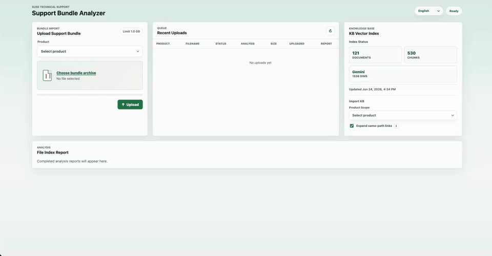
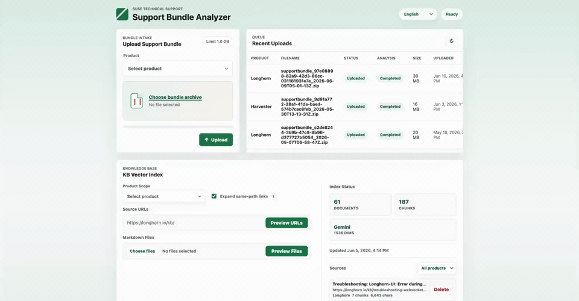

English | [简体中文](README_cn.md)

# SUSE Support Bundle Analyzer

SUSE Support Bundle Analyzer is a local web application for technical support workflows. It helps support engineers upload product support bundles, inspect structured analysis results, review raw evidence, import product KB content, and connect bundle findings with relevant troubleshooting articles.

## What It Does

- Upload Longhorn or Harvester support bundles.
- Generate product inventory, findings, grouped diagnostics, and key log evidence.
- Open raw evidence files and matched log lines from the report.
- Import product KB content and build a local vector index.
- Match bundle findings with imported KB articles.
- Generate AI Advisor troubleshooting guidance when Gemini is configured.

## Demo Videos

### Upload a Bundle and Review Analysis Results



[Open MP4 video](docs/assets/videos/support-bundle-analysis-demo.mp4)

### Import KB and Build the Vector Index



[Open MP4 video](docs/assets/videos/kb-vector-index-demo.mp4)

## Run Locally

```bash
npm run dev
```

Then open:

```text
http://127.0.0.1:3000
```

## Learn More

- [Project Guide](docs/project-guide.md)
